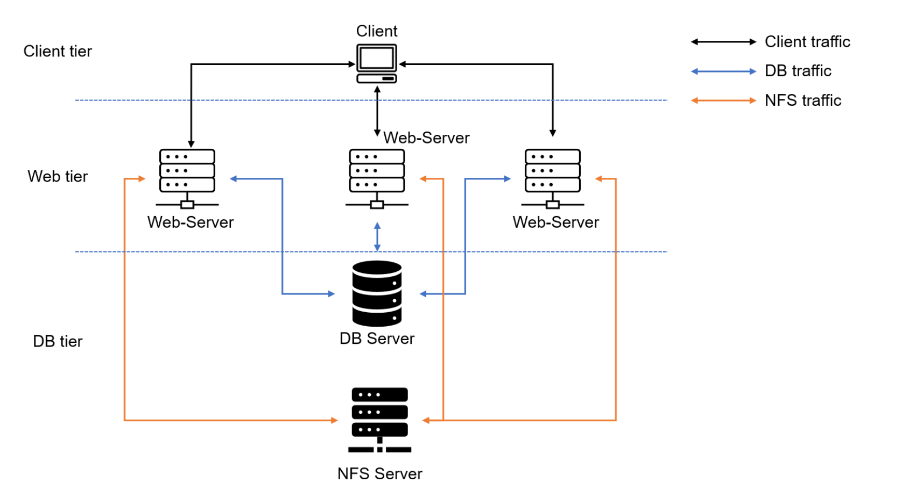

# DEVOPS TOOLING WEBSITE SOLUTION

The Purpose of this project is to be able to implement a tooling website solution which makes access to Devops tools within the corporate infrastructure easily accessible. The project will implement a solution that consist of the following components:

- Infrastructure: AWS
- Webserver Linux: Redhat Enterprise Linux 8
- Database Server: Ubuntu 20.04 + MySQL
- Storage Server: Redhat Enterprise Linux 8 + NFS Server
- Programming Language: PHP
- Code Repository: Github


*the image above shows 3 stateless Web Servers sharing a common database and also accessing same files using Network File System as a shared filed storage*

## Prepare NFS Server

- Launched a new EC2 instance with RHEL Linux Linux 8 Operating System and named the server NFS.

- Created and attached 3 volumes to the NFS server.

- Used gdisk utility to create a single partition on each of the 3 disks
```
sudo gdisk /dev/xvdf 
sudo gdisk /dev/xvdg
sudo gdisk /dev/xvdh
```
- Installed lvm2 package using;
```
sudo yum install lvm2  -y
```

- Used pvcreate utility to mark each of 3 disks as physical volumes (PVs) to be used by LVM
```
sudo pvcreate /dev/xvdf1
sudo pvcreate /dev/xvdg1
sudo pvcreate /dev/xvdh1
```

- Used vgcreate utility to add all 3 PVs to a volume group (VG). Named the VG webdata-vg.
```
sudo vgcreate webdata-vg /dev/xvdh1 /dev/xvdg1 /dev/xvdf1
```
- Used lvcreate utility to create 3 logical volumes. lv-opt lv-apps, and lv-logs
```
sudo lvcreate -n apps-lv -L 9G webdata-vg
sudo lvcreate -n logs-lv -L 9G webdata-vg
sudo lvcreate -n opt-lv  -L 9G webdata-vg
```

- Used mkfs.xfs to format the logical volumes with xfs filesystem
```
sudo mkfs.xfs /dev/webdata-vg/apps-lv
sudo mkfs.xfs /dev/webdata-vg/logs-lv
sudo mkfs.xfs /dev/webdata-vg/opt-lv
```

Created mount point on /mnt directory , for the logical volumes as follows:

```
sudo mkdir -p /mnt/apps
sudo mkdir -p /mnt/logs
sudo mkdir -p /mnt/opt
```
 for webserver, webserver logs and jekins server respectively.

 Mounted apps-lv on /mnt/apps

 ```
 sudo mount /dev/webdata-vg/apps-lv /mnt/apps
 ```

 Mounted logs-lv on /mnt/logs
 ```
 sudo mount /dev/webdata-vg/logs-lv /mnt/logs
 ```

 Mounted opt-lv on /mnt/opt
 ```
 sudo mount /dev/webdata-vg/opt-lv /mnt/opt
 ``` 

 confirmed mount 
 ```
 df -h
 ```


 - Used the command  below to view the UUID of the device in other to copy and update the fstab

 ```
 sudo blkid
 ```
- Updated the fstab with the UUID 
```
sudo vi /etc/fstab
```
- Then the command below was used 
```
sudo mount -a
```

to verify if the mount was successful 
and also being used
```
sudo systemctl daemon-reload
```

to reload the daemon.

## Installation and Configuration of NFS server to start on reboot and making sure it is up and running
```
sudo yum -y update
sudo yum install nfs-utils -y
sudo systemctl start nfs-server.service
sudo systemctl enable nfs-server.service
sudo systemctl status nfs-server.service
```


*the  image above shows the NFS server is up and running*

## Export the mounts for webservers’ subnet cidr to connect as clients

Extracted the subnet cidr  for NFS on the EC2.


- setting up permission that will allow the Web servers to read, write and execute files on NFS:

```
sudo chown -R nobody: /mnt/apps
sudo chown -R nobody: /mnt/logs
sudo chown -R nobody: /mnt/opt

sudo chmod -R 777 /mnt/apps
sudo chmod -R 777 /mnt/logs
sudo chmod -R 777 /mnt/opt

sudo systemctl restart nfs-server.service
```
- Configured access to NFS for clients within the same subnet

```
sudo vi /etc/exports
```

- Then it was exported with the command below so that the web servers will be able to  access it when it they try to connect

```
sudo exportfs -arv
```


- Checked the port used by the NFS in other to configure the security group. 
```
rpcinfo -p | grep nfs
``` 


- However, in other for NfS server to be accessible by the client the following ports: TCP 111, UDP 111, UDP 2049 were also opened in the EC2 security group's inbound rules.


## Database Server Configuration

- Launched a new Ec2 Instance with ubuntu OS and tagged it DB (short for DATABASE) 
- installed and configured mysql-server

```
sudo apt install mysql-server
sudo systemctl start mysql 
sudo systemctl enable mysql 
sudo systemctl status mysql
```

- Created a database and name it tooling

```
CREATE DATABASE tooling;
```
- Created a database user and named it webaccess
```
CREATE USER 'webaccess'@'%' IDENTIFIED BY 'Password1.';
```


- Granted permission to webaccess user on tooling database
```
GRANT ALL PRIVILEGES ON tooling.* TO 'webaccess'@'%' WITH GRANT OPTION 
```
- Verified that the user and database has been successfully created

```
SELECT USER,HOST FROM mysql.user;
SHOW DATABASES
```


- Then the bind address was editted to 0.0.0.0
```
sudo vi /etc/mysql/mysql.conf.d/mysqld.cnf
```
- and restart mysql
```
sudo systemctl restart mysql
```

## Prepare the Web Servers

- Launched 3 new EC2 instance with RHEL 8 Operating System and tagged them webserver1 webserver2 and webserver3 respectively.

The following process was carried out on the 3 instances:

- Intsalled NFS client

```
sudo yum install nfs-utils nfs4-acl-tools -y
sudo systemctl start nfs-server
sudo systemctl enable nfs-server
sudo systemctl status nfs-server 
```

- Mounted /var/www/ and target the NFS server’s export for apps

```
sudo mkdir /var/www

sudo mount -t nfs -o rw,nosuid <NFS-Server-Private-IP-Address>:/mnt/apps /var/www
```

- Verified that NFS was mounted successfully by running df -h and Made sure that the changes will persist on Web Server after reboot:

```
sudo vi /etc/fstab
```

- Added the following line

```
<NFS-Server-Private-IP-Address>:/mnt/apps /var/www nfs defaults 0 0
```

*Note < NFS-Server-Private-IP-Address > was edited*

- Installed Remi’s repository, Apache and PHP

```
sudo yum install httpd -y

sudo systemctl enable httpd 

sudo systemctl start httpd

sudo systemctl status httpd

sudo dnf install https://dl.fedoraproject.org/pub/epel/epel-release-latest-8.noarch.rpm

sudo dnf install dnf-utils http://rpms.remirepo.net/enterprise/remi-release-8.rpm

sudo dnf module reset php

sudo dnf module enable php:remi-7.4

sudo dnf install php php-opcache php-gd php-curl php-mysqlnd

sudo systemctl start php-fpm

sudo systemctl enable php-fpm

sudo setsebool -P httpd_execmem 1

```

- the image below shows that Apache files and directories are available on the Web Server in /var/www and also on the NFS server in /mnt/apps


which implies that the NFS was mounted correctly.

- Located the log folder for Apache on the Web Server and mount it to NFS server’s export for logs. however, the log folder already contain some content therefore before mounting the directory the folder was backedup in other not to loose the content in it.

- The command below was used to rename the folder instead 

```
sudo mv /var/log/httpd /var/log/httpd.backup
```

- Then a new httpd folder was created 

```
sudo mkdir /var/log/httpd
```

- and was mounted to the NFS server's export for logs. 
```
sudo mount -t nfs -o rw,nosuid <NFS-Server-Private-IP-Address>:/mnt/logs /var/log/httpd
```
- Then the fstab was updated to ensure the changes persist after reboot. 

```
sudo vi /etc/fstab
```
- the command below was used to update the process

```
sudo systemctl daemon-reload
```

- set permission
```
sudo chown -R root:root /var/log/httpd
sudo chmod -R 700 /var/log/httpd
```

- Then the command belows was used to copy back the content in httpd.backup folder to httpd folder

```
sudo cp -R /var/log/httpd.backup/. /var/log/httpd
```

- Next is to fork the tooling source code from Darey.io (https://github.com/darey-io/tooling.git) Github Account to my Github account

-  Installed git on the webserver
```
sudo yum install git
```

- Deployed the tooling website’s code to the Webserver by cloning the direcotry 
```
git clone https://github.com/matthew-akinola/dareyio-tooling
```

- The content of the html folder in the tooling directory was deployed to /var/www/html

```
sudo cp -R ~/tooling/html/. /var/www/html
```

- Disabled Apache default page
```
sudo mv /etc/httpd/conf.d/welcome.conf /etc/httpd/conf.d/welcome.conf_backup
```
- changed permission to /var/www/html folder
```
 sudo chown -R apache:apache /var/www/html
```
- Disabled SELinux 
```
sudo setenforce 0
```

- To make changes permanent Selinux was disabled (SELINUX=disabled) in the config file 

```
sudo vi /etc/sysconfig/selinux
```


- then restarted httpd.
```
sudo systemctl restart httpd
```

- Installed mysql server 
```
sudo yum install mysql-server
```

- The website configuration file (in /var/www/html/functions.php) was updated to connect to the database.
```
sudo vi /var/www/html/functions.php
```
filled in the details correctly, ip address, username, password and database name


- Apply tooling-db.sql script to your database using this command mysql -h <databse-private-ip> -u <db-username> -p <db-pasword> < tooling-db.sql

 ```
sudo setsebool -P httpd_can_network_connect=1
sudo setsebool -P httpd_can_network_connect_db=1
sudo setsebool -P httpd_execmem=1
sudo setsebool -P httpd_use_nfs 1
```

-  connected to the database from the tooling folder

```
sudo mysql -h 172.31.22.125 -u webaccess -p tooling < tooling-db.sql
```

- Accessed the 3 webservers public ip address from my broswer. refer to the images below


